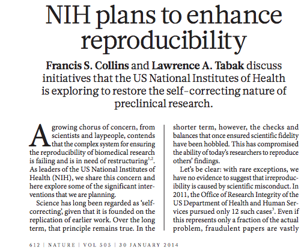
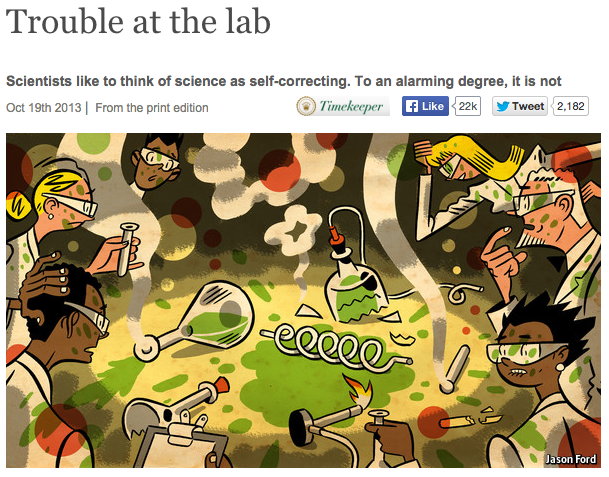
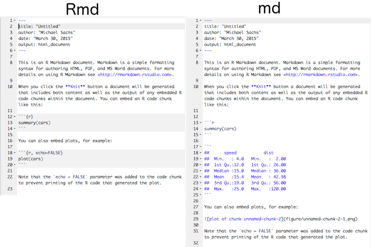

# Introduction

## Reproducibility




## At the lab?



## Where do we fit in? 


## Data analysis


Goal: code + prose = report

## Solution

- Cut and paste for report production is not a viable method
    + tedious
    + slow
    + error-prone
- Incorporate analysis code into text documents
    + `knit` to create results
    + results get incorporated into document
    + post-process to get any type of output format
- Literate documents
    + R Code creates results to inform report
    + Prose surrounding code informs analysis
    
## How? Markdown.


## Contrast with html


## ... and tex


## Incorporating code chunks {.smaller}


Three backticks, each chunk needs a unique name:


    ```{r my-first-chunk}
    ## code goes in here and gets evaluated
    t.test(mpg ~ vs, data = mtcars)
    ```

```
## 
## 	Welch Two Sample t-test
## 
## data:  mpg by vs
## t = -4.6671, df = 22.716, p-value = 0.0001098
## alternative hypothesis: true difference in means is not equal to 0
## 95 percent confidence interval:
##  -11.462508  -4.418445
## sample estimates:
## mean in group 0 mean in group 1 
##        16.61667        24.55714
```

Inline code uses single backticks

The mean mpg is `` `r mean(mtcars$mpg)` ``. 

The mean mpg is 20.090625. 

## Try it

- Open Rstudio
- Click New > Rmarkdown
- Select output format

#### Examine the markdown prose and the code.
#### What do you expect the output to look like?

- Click `knit`
- What do you get?

## How it works: knitr

Code chunks are evaluated sequentially the same, fresh R session:



## How it works: pandoc

- Pandoc converts the markdown format to some other document type: 
     + Word
     + Html
     + Pdf
     + ...
- Templates and output formats for specific uses:
    + Beamer slideshows
    + ioslides presentations
    + Tufte-style handouts

## Caveats

- Markdown is minimalistic
- Easy to write and read

rmarkdown + knitr is designed to _quickly_ and _simply_ generate analytic reports with minimal markup

- Not complex or precise enough for __complete__ control over output
- How much precision do you need? 


## Markdown specs

- Paragraphs, `# headers, ## subheader, etc`, `> blockquotes`
- Emphasis, `_italics_, *italics*, __bold__, **bold**`
- Images/links: ``, `[text](link)`
- Lists/ordered lists
- Code chunks
- Latex equations: `$\sum_{i=1}^nX_i/n$` = $\sum_{i=1}^nX_i/n$
- Tables
- Citations: `[@citekey]`, bibtex, endnote, others supported


## Front matter

- Metadata
- Document types
- Other options
    + Default figure size, table of contents, theme
    + See http://rmarkdown.rstudio.com/ for complete documentation

```
---
title: "Reproducible Analyses with knitr and rmarkdown"
author: "Michael Sachs"
date: "March 31, 2015"
output:
  ioslides_presentation:
    widescreen: true
---
```


# Controlling R output

## knitr chunk output

### Results

Default: `results = 'markup'`


    ```{r markup, results = 'markup'}
    head(mtcars, 4)
    ```

```
##                 mpg cyl disp  hp drat    wt  qsec vs am gear carb
## Mazda RX4      21.0   6  160 110 3.90 2.620 16.46  0  1    4    4
## Mazda RX4 Wag  21.0   6  160 110 3.90 2.875 17.02  0  1    4    4
## Datsun 710     22.8   4  108  93 3.85 2.320 18.61  1  1    4    1
## Hornet 4 Drive 21.4   6  258 110 3.08 3.215 19.44  1  0    3    1
```

## knitr chunk output

`results = 'asis'`


    ```{r asis, results = 'asis'}
    head(mtcars, 4)
    ```
                mpg cyl disp  hp drat    wt  qsec vs am gear carb
Mazda RX4      21.0   6  160 110 3.90 2.620 16.46  0  1    4    4
Mazda RX4 Wag  21.0   6  160 110 3.90 2.875 17.02  0  1    4    4
Datsun 710     22.8   4  108  93 3.85 2.320 18.61  1  1    4    1
Hornet 4 Drive 21.4   6  258 110 3.08 3.215 19.44  1  0    3    1


## knitr chunk output

### Make tables pretty

`results = 'asis'`


    ```{r kasis, results = 'asis'}
    kable(head(mtcars, 4))
    ```


|               |  mpg| cyl| disp|  hp| drat|    wt|  qsec| vs| am| gear| carb|
|:--------------|----:|---:|----:|---:|----:|-----:|-----:|--:|--:|----:|----:|
|Mazda RX4      | 21.0|   6|  160| 110| 3.90| 2.620| 16.46|  0|  1|    4|    4|
|Mazda RX4 Wag  | 21.0|   6|  160| 110| 3.90| 2.875| 17.02|  0|  1|    4|    4|
|Datsun 710     | 22.8|   4|  108|  93| 3.85| 2.320| 18.61|  1|  1|    4|    1|
|Hornet 4 Drive | 21.4|   6|  258| 110| 3.08| 3.215| 19.44|  1|  0|    3|    1|


## Other options

- `include = FALSE` evaluates code but doesn't include anything
- `echo = FALSE` don't display results
- `warning = FALSE` don't display warnings
- `cache = TRUE` cache results for long-running stuff
- `comment = NA` hide `#` from output


## Figure options

The important ones:

- `fig_width`, `fig_height`, in inches. Can also be set globally.
- `fig_align`, left, right or center
- `fig_cap = "Caption"` add caption to figure


## Resources

 Topic | Link 
 ------|------
KBroman's UWisc Class | https://kbroman.github.io/Tools4RR/pages/schedule.html
Knitr homepage | http://yihui.name/knitr/
rmarkdown documentation | http://rmarkdown.rstudio.com/
Another knitr tutorial | http://sachsmc.github.io/knit-git-markr-guide
Pandoc reference | http://johnmacfarlane.net/pandoc/
